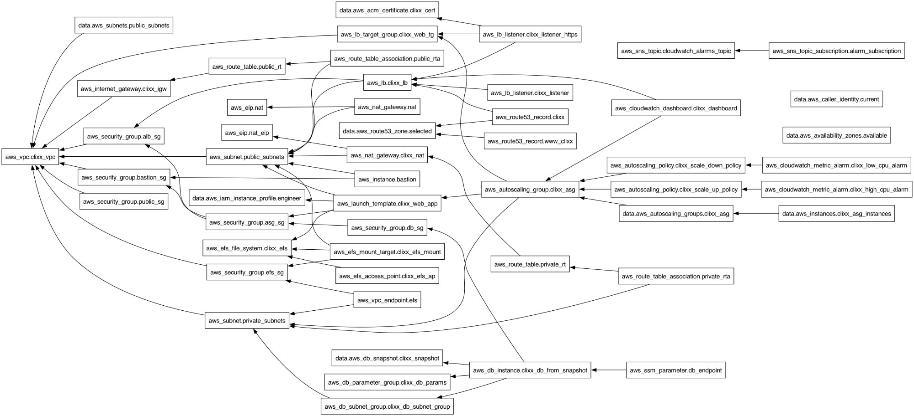

# AWS ECS Infrastructure — Containerized WordPress on EC2

Production-grade ECS infrastructure for running a containerized WordPress application on AWS. Includes VPC networking, ECS cluster with EC2 capacity provider, NLB with TLS termination, RDS database, CloudWatch monitoring with custom metrics, Inspector v2 vulnerability scanning, and a Jenkins CI/CD pipeline for golden AMI builds and automated deployments.

## Architecture



### Components

- **VPC** with public and private subnets across 2 AZs, purpose-segmented (web, app, database, microservices)
- **ECS Cluster** with EC2 launch type, capacity provider, and managed scaling
- **ECS Service** with awsvpc networking, deployment circuit breaker, and ECS Exec support
- **Network Load Balancer** with TCP (80) and TLS (443) listeners
- **RDS MySQL** restored from snapshot, deployed in private subnets
- **VPC Endpoints** for ECR API, ECR Docker, and S3 (private image pulls without NAT)
- **Bastion Hosts** (x2) for SSH access to private instances
- **NAT Gateways** (x2) for HA outbound connectivity
- **Route 53** DNS with alias record pointing to the NLB
- **CloudWatch** dashboard, CPU/memory/unhealthy host alarms, CloudWatch Agent, and SNS notifications
- **Inspector v2** continuous vulnerability scanning for EC2 and ECR
- **IAM** least-privilege roles for ECS instances, task execution, and tasks
- **Jenkins CI/CD** pipeline: Packer AMI build → SSM registration → Terraform deploy → Inspector scan

### ECS Architecture

```
NLB (Public)
  ├── Port 80  (TCP)  → Target Group → ECS Tasks (awsvpc, port 80)
  └── Port 443 (TLS)  → Target Group → ECS Tasks (awsvpc, port 80)

ECS Cluster
  └── Capacity Provider → ASG (EC2 instances in private subnets)
      └── Launch Template → ECS-optimized AMI (Packer-built)
          └── CloudWatch Agent + ECS Agent

ECS Task Definition
  └── Container: WordPress (from ECR)
      ├── DB credentials: SSM Parameter Store (SecureString)
      ├── Logs: CloudWatch Logs (awslogs driver)
      └── Network: awsvpc mode (dedicated ENI per task)
```

### Security Group Chain

```
Internet → NLB (no SG — Layer 4)
             ↓
           ASG SG (80, 443 from anywhere | 22 from Bastion)
           Task SG (80, 443 from anywhere — awsvpc mode)
             ↓
           DB SG (3306 from ASG SG + Task SG)
           VPC Endpoint SG (443 from Task SG + ASG SG)
```

### Network Layout

```
VPC: 10.0.0.0/16

Public Subnets (NLB, NAT Gateways):
  10.0.0.0/23  — AZ-A (512 hosts)
  10.0.2.0/23  — AZ-B (512 hosts)

Private Subnets:
  10.0.4.0/24  — ECS App Tier 1, AZ-A
  10.0.5.0/24  — ECS App Tier 1, AZ-B
  10.0.6.0/24  — App Tier 2 (reserved), AZ-A
  10.0.7.0/24  — App Tier 2 (reserved), AZ-B
  10.0.8.0/24  — RDS Primary, AZ-A
  10.0.9.0/24  — RDS Standby, AZ-B
  10.0.10.0/24 — Oracle (reserved), AZ-A
  10.0.11.0/24 — Oracle (reserved), AZ-B
  10.0.12.0/26 — Microservices, AZ-A
  10.0.12.64/26— Microservices, AZ-B
```

## Prerequisites

- Terraform >= 1.3.0
- Packer (for AMI builds)
- AWS CLI configured with appropriate credentials
- An ECS-optimized AMI (or use the included Packer pipeline to build one)
- A Docker image pushed to ECR
- A Route 53 hosted zone and wildcard ACM certificate for your domain
- An RDS snapshot to restore from
- SSM parameters for database credentials (`/clixx/wp_db_name`, `/clixx/wp_db_user`, `/clixx/clixx_db_password`)

## Quick Start

```bash
# Clone the repository
git clone https://github.com/Kwamib/aws-ecs-infra.git
cd aws-ecs-infra

# Create your variable file
cp terraform.tfvars.example terraform.tfvars
# Edit terraform.tfvars with your values

# Initialize and deploy
terraform init
terraform plan
terraform apply
```

## Project Structure

```
.
├── asg.tf                    # Auto Scaling Group for ECS EC2 instances
├── backend.tf                # S3 remote state backend
├── cloudwatch.tf             # Alarms, SNS, dashboard, CloudWatch Agent config
├── data.tf                   # Data sources (ACM, snapshots, SSM parameters)
├── ecs.tf                    # ECS cluster, capacity provider, task definition, service, launch template
├── iam.tf                    # IAM roles and policies (instance, execution, task)
├── inspector.tf              # AWS Inspector v2 vulnerability scanning
├── jumpbox.tf                # Bastion hosts (HA, one per AZ)
├── locals.tf                 # Local variables and computed values
├── nat_gateway.tf            # NAT gateways and Elastic IPs
├── internet_gateway.tf       # Internet gateway
├── nlb.tf                    # Network Load Balancer, listeners, target groups
├── outputs.tf                # Stack outputs
├── provider.tf               # AWS provider configuration
├── rds.tf                    # RDS instance, parameter group, subnet group
├── route53.tf                # DNS records
├── route_tables.tf           # Public and private route tables
├── security_groups.tf        # All security groups (ALB, ASG, task, DB, bastion, VPC endpoint)
├── subnets.tf                # Public and private subnets
├── userdata.sh               # EC2 bootstrap (CloudWatch Agent, ECS agent config)
├── vars.tf                   # Input variable definitions
├── versions.tf               # Terraform and provider version constraints
├── vpc.tf                    # VPC resource
├── vpc_endpoints.tf          # ECR API, ECR Docker, and S3 gateway endpoints
├── Jenkinsfile               # CI/CD pipeline (Packer → SSM → Terraform → Inspector)
├── terraform.tfvars.example  # Example variable values
├── .gitignore
├── docker/
│   ├── Dockerfile            # WordPress container with custom entrypoint
│   └── entrypoint.sh         # Generates wp-config.php from environment variables
├── images/
│   └── image_pkr.hcl         # Packer template for ECS-optimized golden AMIs
├── scripts/
│   └── setup.sh              # AMI provisioning script (Docker, AWS CLI, ECS config)
└── docs/
    └── architecture-graph.png
```

## CI/CD Pipeline

The Jenkins pipeline automates the full deployment lifecycle:

1. **Packer AMI Build** — builds an ECS-optimized golden AMI with Docker, AWS CLI, and monitoring tools
2. **SSM Registration** — publishes AMI ID, version, and build date to SSM Parameter Store
3. **Terraform Init** — initializes providers and backend
4. **State Cleanup** — removes legacy Inspector v1 resources
5. **Terraform Plan** — generates execution plan
6. **Terraform Apply** — deploys infrastructure and triggers Inspector scanning
7. **Vulnerability Report** — exports Inspector v2 findings as build artifacts

## Key Design Decisions

- **EC2 launch type over Fargate** — chosen for cost control and custom AMI support (CloudWatch Agent, ECS agent tuning)
- **NLB over ALB** — Layer 4 load balancing for TCP/TLS passthrough with lower latency
- **awsvpc network mode** — each ECS task gets its own ENI for fine-grained security group control
- **VPC Endpoints for ECR** — private image pulls without routing through NAT gateway (cost and security)
- **Deployment circuit breaker** — automatic rollback on failed deployments
- **SecureString SSM parameters** — database credentials injected as ECS secrets, never in code
- **CloudWatch Agent via SSM** — memory and disk metrics pushed to CloudWatch for complete observability
- **Inspector v2** — continuous vulnerability scanning integrated into the deployment pipeline

## License

MIT
